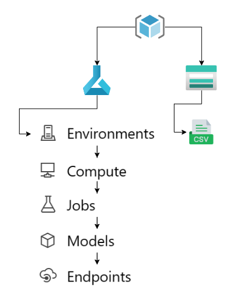
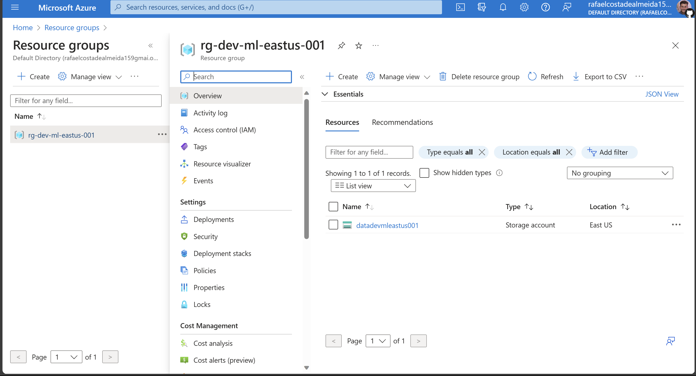
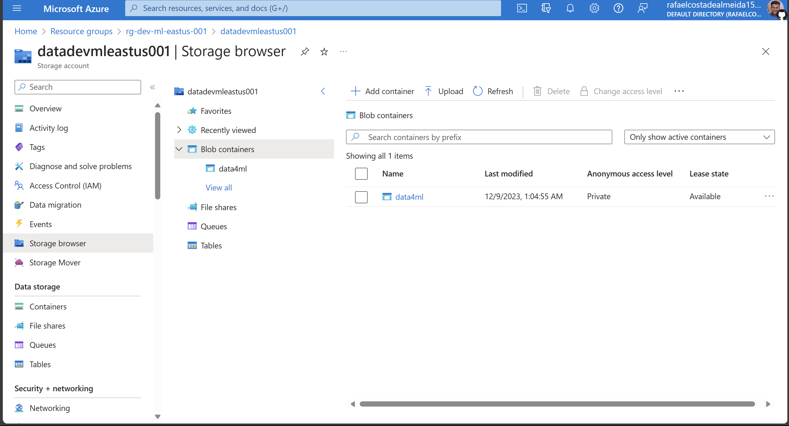
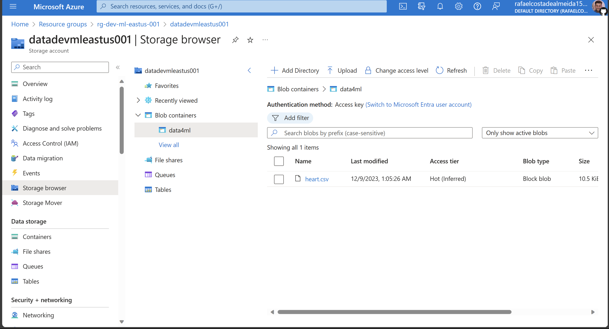
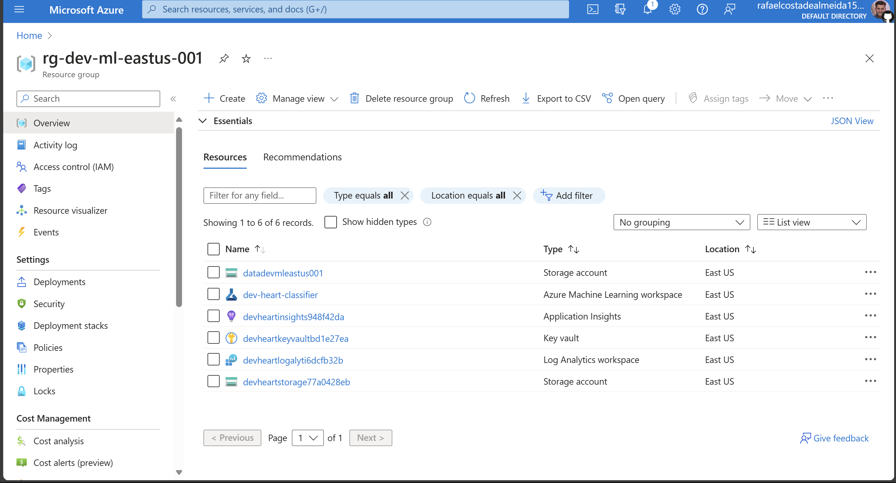
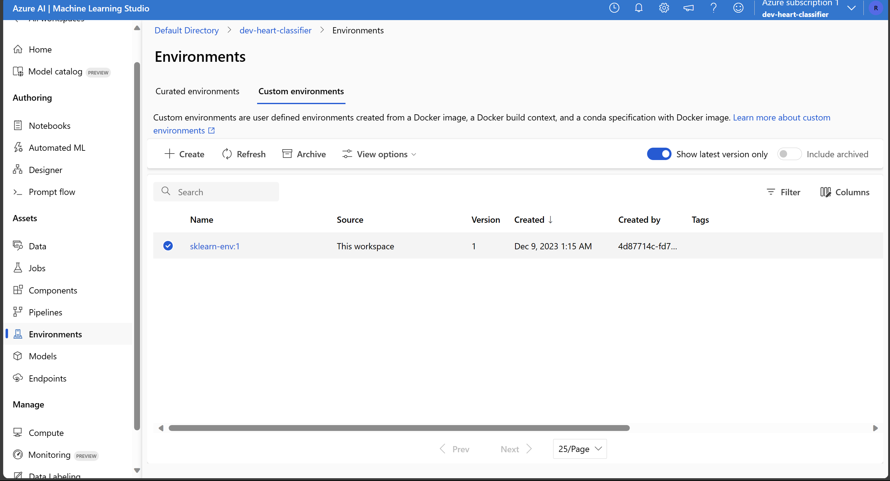
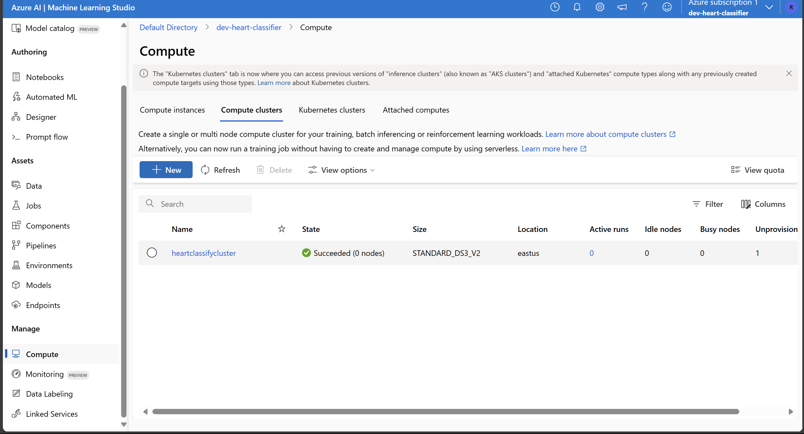

# Desbravando Machine Learning na Azure com um exemplo completo: Parte 1 - Preparação do Ambiente

## Introdução

Bem-vindo ao nosso primeiro post sobre os serviços da Azure, com ênfase em Machine Learning. Vamos mergulhar na construção de um pipeline abrangente, abordando desde a concepção de recursos até a implementação de um endpoint de inferência para um modelo de classificação.

Apesar de abordarmos aspectos técnicos, a proposta deste post é descomplicar o processo, fornecendo uma visão clara e simplificada. O foco é transmitir a simplicidade na criação de um workflow completo usando as ferramentas da Azure. Análises mais aprofundadas e implementações de ideias mais complexas serão exploradas nos próximos posts.

Nosso objetivo é proporcionar uma visão geral, guiando você por cada etapa do processo para que possa aplicar o necessário em seu projeto!

## Desvendando o Workflow: Os passos que serão feitos

Para que possamos nos concentrar nas diferentes etapas do processo, iremos dividir nossa exploração em duas partes (e dois posts). A primeira parte terá como foco a criação de um ambiente organizado e funcional, enquanto a segunda abordará o treinamento e a inferência de modelos de Machine Learning. Nosso primeiro objetivo é configurar todas as dependências do ambiente, preparando-o para que, na segunda etapa, possamos nos dedicar à parte mais envolvente do Machine Learning!

Iniciaremos estabelecendo um ambiente organizado, criando um Resource Group, configurando um Storage Account e preparando um Blob Container para armazenar nossos dados. Além disso, abordaremos o processo de upload desses dados para o Storage Account, um passo fundamental para o treinamento de modelos de Machine Learning.

No segundo post, que será apresentado em seguida, aproveitaremos a potência da Azure ao lançar vários experimentos em um Cluster de Machine Learning de forma simplificada. Nesse contexto, discutiremos a busca por hiperparâmetros, que é essencial para otimizar o desempenho dos modelos.

Ao entrarmos no pré-processamento de dados, destacaremos a importância da divisão de datasets para evitar vazamento de dados entre treino e teste, e a transformação das features para que o modelo compreenda as informações.

### 1. Primeira Etapa

#### 1.1 Criar um Resource Group:
- O ponto de partida é a criação de um "Resource Group" (Grupo de Recursos), um contêiner que centraliza todos os elementos relacionados à nossa solução na Azure. Essa abordagem proporciona uma gestão organizada e coordenada de recursos com ciclos de vida semelhantes.
#### 1.2 Criar um Storage Account:
- Em seguida, criaremos uma "Storage Account" (Conta de Armazenamento) para abrigar nossos dados na Azure. Esta recurso serve como um repositório durável e altamente disponível, ideal para armazenar objetos de dados, como blobs, arquivos, filas e tabelas.
#### 1.3 Upload do Dataset do Kaggle:
- Faremos o upload de um conjunto de dados que se encontra disponível na plataforma [Kaggle](https://www.kaggle.com/), garantindo que nossos dados estejam prontos para alimentar os experimentos de machine learning. O Dataset escolhido é o [Heart Attack Analysis & Prediction Dataset](https://www.kaggle.com/datasets/rashikrahmanpritom/heart-attack-analysis-prediction-dataset/).
#### 1.4 Criar um Environment Customizado:
- Criamos um ambiente personalizado para treinamento e inferência do modelo. Os "Environments" no Azure Machine Learning encapsulam configurações necessárias, assegurando a reprodução do workflow em diferentes destinos de computação. Optamos por um ambiente customizado em vez de uma imagem pronta para destacar a facilidade desse processo.
#### 1.5 Criar um Cluster de Computação:
- A construção de um cluster é crucial. Esse cluster de computação gerenciado permite o lançamento de múltiplos experimentos, escalando verticalmente conforme necessário. Dessa forma, podemos concentrar nossos esforços no desenvolvimento do modelo.

### 2. Segunda Etapa
#### 2.1 Análise e Pré-processamento do Dataset:
- Realizaremos uma análise detalhada das características do dataset, identificando padrões e estabelecendo um pipeline adequado para o pré-processamento de dados. Essa etapa é crucial para assegurar que os dados estejam prontos para serem consumidos pelo modelo.
#### 2.2 Criar um Job para Busca de Hyperparâmetros:
- Lançaremos um job no cluster configurado para realizar a busca de hyperparâmetros. Esses ajustes são fundamentais e impactam diretamente o desempenho do modelo. O Azure Machine Learning simplifica esse processo, permitindo automação e execução eficiente de experimentos em paralelo.
#### 2.3 Seleção do Melhor Modelo:
- Com base nos resultados dos experimentos, escolheremos o melhor modelo, utilizando a acurácia como critério nesta instância. Essa escolha informada é essencial para garantir que o modelo final seja o mais eficaz possível.
#### 2.4 Criar um Endpoint de Inferência:
- Finalmente, implementaremos um endpoint de inferência no Azure Machine Learning. Isso nos permitirá realizar inferências em tempo real com o modelo encontrado.
#### 2.5 Testar o Modelo através do Endpoint:
- Concluiremos nosso workflow testando o modelo por meio do endpoint criado. Este é o último passo para garantir que nosso modelo esteja pronto para fornecer previsões precisas no ambiente de produção.

Ao seguir esses passos, não apenas estabeleceremos um pipeline abrangente, mas também experimentaremos o poder e a eficiência do Azure para acelerar e gerenciar todo o ciclo de vida de projetos de machine learning.

Podemos resumir os passos que serão feitos como segue a figure abaixo:



Criamos o resource group, depois o storage account e fazemos o upload do dataset, nesse caso utilizaremos um dataset contido um um arquivo `.csv`. Depois criaremos um ambiente de trabalho Azure Machine Learning onde faremos a configuração do ambiente, configuração do cluster de computação, o lançamento da busca de hyperparâmetros, obteremos um modelo e criaremos um endpoint para inferência com este modelo.

## Primeira Seção do Desenvolvimento: Setando o Ambiente e Dependências

Para assegurar um ambiente consistente e programático, optaremos por desenvolver todo o processo em Python. Isso requer uma subscrição na Azure com as permissões adequadas para criar e excluir recursos.
Todas as variáveis de ambiente necessárias serão armazenadas em um arquivo chamado `.env` e acessadas em Python por meio de `os.environ.get("VAR_NAME")`.

Para simplificar a instalação das dependências, utilizaremos um arquivo de requisitos Python chamado `requirements.txt`, que incluirá as bibliotecas essenciais fornecidas pela Azure:

```txt
azure-identity
azure-mgmt-resource
azure-mgmt-storage
azure-storage-blob
azure-ai-ml
pyyaml
python-dotenv
azureml-mlflow
scikit-learn
pandas
numpy
```

Agora, partiremos para a implementação. Primeiramente, importaremos o código do repositório ([end-to-end-ml-post](https://github.com/raca159/end-to-end-ml-post)) para ter acesso aos scripts de configuração do ambiente, treinamento e inferência:

```python
import os
from dotenv import load_dotenv
from src import env_builder
```

Com o script `env_builder` importado, podemos prosseguir com os passos de criação de recursos. Sinta-se à vontade para revisar o código de cada função para compreender melhor o processo.

Começaremos criando o resource group, pense em uma caixa no qual colocaremos todos as peças necessárias para executar o modelo. Nessa caixa, iremos criar uma peça para armazenar os dados e outra para criar, treinar e testar os modelos.

```python
# Carrega as variáveis de ambiente
_ = load_dotenv()

# Obtém o SUBSCRIPTION_ID do ambiente
SUBSCRIPTION_ID = os.environ.get('SUBSCRIPTION_ID')

# Cria um nome para o grupo de recursos
resource_group_name = 'rg-dev-ml-eastus-001'
# Seleciona uma localização
location = 'eastus'
# Cria o recurso
env_builder.get_or_create_rg(
    resource_group_name=resource_group_name,
    location=location,
    subscription_id=SUBSCRIPTION_ID
)
```

O código acima ilustra o processo de criação de um grupo de recursos por meio de Python. Com o grupo de recursos criado, podemos criar um storage account neste resource group. O código abaixo faz examente isto:

```python
# Cria um nome para a conta de armazenamento
storage_account_name = 'datadevmleastus001'
# Cria o recurso
rg_deployment_result = env_builder.create_storage_account(
    storage_account_name=storage_account_name,
    subscription_id=SUBSCRIPTION_ID,
    resource_group_name=resource_group_name,
    location=location
)
# Obtém informações de saída sobre a conta de armazenamento
storage_account_info = rg_deployment_result.properties.as_dict()['outputs']
```

Como podemos ver na imagem abaixo, após executar os comandos acima, temos um resource group com um storage account.



Com o storage account criado, podemos acessá-lo por meio de uma string de conexão. Essa informação pode ser obtida configurando o template ARM usado para retornar essa informação como output ou copiando-a diretamente do portal e adicionando-a ao arquivo `.env`. Para acessá-la, faremos:

```python
# Obtendo e setando pelo output do ARM
os.environ['CONNECTION_STRING_STORAGE_ACCOUNT'] = storage_account_info['storageAccountConnectionString']['value']
# caso queira pegar a string pelo portal, coloque no .env e carregue novamente as variáveis
# _ = load_dotenv()
conn_string_storage_account = os.environ.get('CONNECTION_STRING_STORAGE_ACCOUNT')
```
Com o storage account criado, podemos criar um blob container para armazenar os dados. Este processo será abordado na próxima seção.

## Segunda Seção do Desenvolvimento: Escolha dos Dados e Upload para Blob Container

Nesta seção, abordaremos a seleção de dados para este post e discutiremos a tarefa de aprendizado supervisionado em questão. Optamos por utilizar o conjunto de dados [Heart Attack Analysis & Prediction Dataset](https://www.kaggle.com/datasets/rashikrahmanpritom/heart-attack-analysis-prediction-dataset/), disponível no Kaggle.

Escolhemos esse conjunto de dados devido à sua simplicidade e tamanho moderado. No entanto, ele apresenta características que exigem um pipeline de pré-processamento para treinar modelos de classificação binária.

A tarefa em questão é classificar, com base nas características fornecidas, se há uma probabilidade maior (classe 1) ou menor (classe 0) de ocorrer um ataque cardíaco. O dataset inclui uma coluna chamada `output`, que representa a classe binária, juntamente com várias colunas contendo as características:
- `age`: Idade da pessoa
- `sex`: Gênero da pessoa
- `cp`: Tipo de dor no peito
- `trtbps`: Pressão arterial em repouso (mm Hg)
- `chol`: Colesterol em mg/dl obtido através do sensor de IMC
- `fbs`: Glicemia em jejum > 120 mg/dl (1 = verdadeiro; 0 = falso)
- `restecg`: Resultados eletrocardiográficos em repouso
- `thalachh`: Frequência cardíaca máxima alcançada
- `exng`: Angina induzida por exercício (1 = sim; 0 = não)
- `oldpeak`: Pico anterior

Note que essas features incluem valores numéricos como idade, valores binários como sexo e valores categóricos como cp, que contém 4 categorias:
- Valor 1: Angina típica
- Valor 2: Angina atípica
- Valor 3: Dor não anginosa
- Valor 4: Assintomático

Para trabalhar com esses dados, será necessário implementar um pipeline de pré-processamento para cada tipo de feature.

Antes de iniciarmos o trabalho com os dados, precisamos fazer o upload deles para um blob container na Azure. Vamos criar o container utilizando a string de conexão obtida na seção anterior:
```python
# Cria um cliente Blob usando a string de conexão
blob_client = env_builder.get_blob_service_client_connection_string(
    conn_string_storage_account=conn_string_storage_account
)

# Nome do contêiner
container_name = 'data4ml'

# Cria o contêiner e/ou recupera o cliente do contêiner
container_client = env_builder.create_blob_container(blob_service_client=blob_client, container_name=container_name)
```

Com isso, temos um container criado para podermos fazer o upload do dataset.


Agora, vamos até a página do Kaggle, realizamos o download do dataset, e nomeamos o arquivo como `heart.csv`.
Para garantir que nossos testes com modelos de Machine Learning sejam significativos, realizaremos uma etapa antes de carregar o dataset na Azure. Vamos dividir os dados entre treino e teste, e subiremos apenas o arquivo de treino para a Azure. Essa abordagem nos permitirá testar nosso endpoint de inferência usando dados que o modelo nunca viu antes.
Essa etapa é crucial em qualquer projeto de Machine Learning, pois só podemos avaliar o desempenho de um modelo utilizando dados que não foram usados durante o treinamento. Para isso, seguiremos os passos:
```python
import pandas as pd
from sklearn.model_selection import train_test_split

# carregar os dados como um DataFrame pandas
df = pd.read_csv('heart.csv', index_col=0)
# utilizamos o modelo de split do scikit-learn para separar 10% dos dados como dataset de test
xtrain, xtest, _, _ = train_test_split(df, df['output'], test_size=0.1)
# salvamos os datasets separados para podermos testar a inferencia com o `heart.test.csv`
xtrain.to_csv('heart.csv', index=False)
xtest.to_csv('heart.test.csv', index=False)
```
Agora, com os dados própriamente divididos, passamos a fazer o upload do arquivo de treino para o container:
```python
# Caminho para o arquivo do conjunto de dados
filepath = 'heart.csv'
# Faz o upload do arquivo usando o cliente do contêiner
env_builder.upload_blob_file(
    filepath=filepath, blobname=filepath,
    container_client=container_client
)
```

Como podemos ver, agora temos a parte de dados concluído, temos o dataset pronto para uso na Azure.


## Terceira Parte do Desenvolvimento: Criando o Ambiente do Azure Machine Learning Studio

Agora que configuramos o Resource Group e o Container com os dados, podemos avançar para a criação da infraestrutura necessária para treinar nossos modelos no Azure Machine Learning. Nesta seção, concentraremos nossos esforços na criação de um Workspace, um Environment e um Compute Cluster para conduzir a busca de hyperparameters.

Iniciaremos criando um cliente Python para interagir com o Azure Machine Learning. O código abaixo será usado para criar o Workspace:
```python
# Nome do workspace a ser criado
workspace = 'dev-heart-classifier'

# Criando o workspace e retornando o cliente
ml_client = env_builder.get_mlclient_and_create_workspace(
    subscription_id=SUBSCRIPTION_ID,
    resource_group=resource_group_name,
    location=location,
    workspace=workspace
)
```

Agora, além do storage account para armazenar os dados, temos o Azure Machine Learning para criar modelos. É importante observar que outros recursos são criados automaticamente pela Azure e estão associados ao workspace do Azure Machine Learning.



Com o workspace criado e um cliente Python pronto para interagir, o próximo passo é criar um Environment personalizado. A utilização de um ambiente personalizado permite abordar casos mais específicos nos quais é necessário incluir bibliotecas específicas para o treinamento de um modelo.

Utilizaremos um arquivo YAML para configurar o ambiente com as bibliotecas necessárias. O arquivo YAML para isso é o seguinte:
```yaml
# Arquivo: conda.yaml
name: sklearn-env
channels:
  - conda-forge
dependencies:
  - python=3.8
  - pip=21.2.4
  - scikit-learn=0.24.2
  - scipy=1.7.1
  - pandas
  - numpy
  - pip:  
    - mlflow== 1.26.1
    - azureml-mlflow==1.42.0
    - mlflow-skinny==2.3.2
    - azureml-inference-server-http
```

Para criar o Environment, usaremos a imagem base `mcr.microsoft.com/azureml/openmpi4.1.0-ubuntu20.04:latest`. O código para essa tarefa é o seguinte:

```python
# Caminho para o arquivo yaml
conda_yaml_path='conda.yaml'
# Imagem base a ser usada no Environment
base_image="mcr.microsoft.com/azureml/openmpi4.1.0-ubuntu20.04:latest"
# Descrição do ambiente, pode conter qualquer informação útil.
description = ''

# Cria o Environment
job_env = env_builder.get_or_create_enviroment(
    ml_client=ml_client, conda_yaml_path=conda_yaml_path,
    base_image=base_image, description=description
)
```

Com o Workspace e Environment criados, o próximo passo é criar o cluster para treinar modelos de Machine Learning. Nos concentraremos em um cluster pequeno e simples, utilizando apenas um nó e instâncias de baixa capacidade computacional.

```python
# Nome do workspace onde o cluster será criado
workspace = 'dev-heart-classifier'
# Configuração do cluster
config = {
    'name': "heartclassifycluster",  # Nome do cluster
    'type': "amlcompute",
    'size': "STANDARD_DS3_v2",  # Instância de computação a ser usada. Isso pode mudar dependendo da carga de trabalho
    'location': "eastus",  # Localização do recurso
    'min_instances': 0,
    'max_instances': 1,
    'idle_time_before_scale_down': 10  # Tempo ocioso antes de desligar o recurso de computação. Isso ajuda a lançar vários trabalhos sem se preocupar que a VM esteja ligada o tempo todo.
}
# Cria o cluster e retorna os detalhes da operação
cluster_info = env_builder.get_or_create_compute_cluster(
    ml_client=ml_client, cluster_config=config
)
```
É importante notar que neste cluster, estamos utilizando instâncias de máquinas sem acesso a GPU, e limitamos a quantidade de nós devido à simplicidade e escala do problema. Em cenários mais complexos, pode ser necessário executar com mais nós e máquinas mais potentes.

Conforme mostram as imagens, dentro do Azure Machine Learning, temos o Environment e o cluster de computação para executar o script de treinamento e inferência.



## Deletando Recursos e Conclusão
Com essas etapas concluídas, finalizamos a primeira parte da implementação de um pipeline completo de Machine Learning na Azure. Neste post, concluímos a preparação do ambiente com todos os recursos prontos, incluindo os dados para nossos modelos.

Para encerrar, lembre-se de que os recursos na Azure são cobrados. Portanto, é uma prática recomendada excluir os recursos que não são mais necessários para evitar custos desnecessários. Para deletar todos os recursos criados, incluindo o grupo de recursos, você pode usar o seguinte código:

```python
env_builder.ml_workspace_deletion(ml_client=ml_client, workspace=workspace)

delete_result = env_builder.get_and_delete_rg(
    resource_group_name=resource_group_name,
    subscription_id=SUBSCRIPTION_ID
)
```
Ao executar esse código, todos os recursos no grupo de recursos especificado, incluindo o workspace do Azure Machine Learning, clusters, modelos e outros artefatos relacionados serão deletados.

Neste post, concluímos a criação do ambiente na Azure, podendo ser estendido e modificado para qualquer pipeline envolvendo Machine Learning.

No próximo post, vamos desenvolver um script de treinamento, lançar uma busca de hiperparâmetros para encontrar o melhor modelo, criar um endpoint de inferência, testar a inferência no endpoint com o melhor modelo usando um conjunto de dados de teste e avaliar o desempenho do modelo com métricas de classificação.

Espero que este post tenha sido útil para você começar com o Azure Machine Learning e nos vemos no próximo!