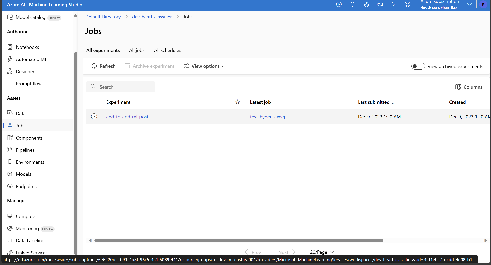
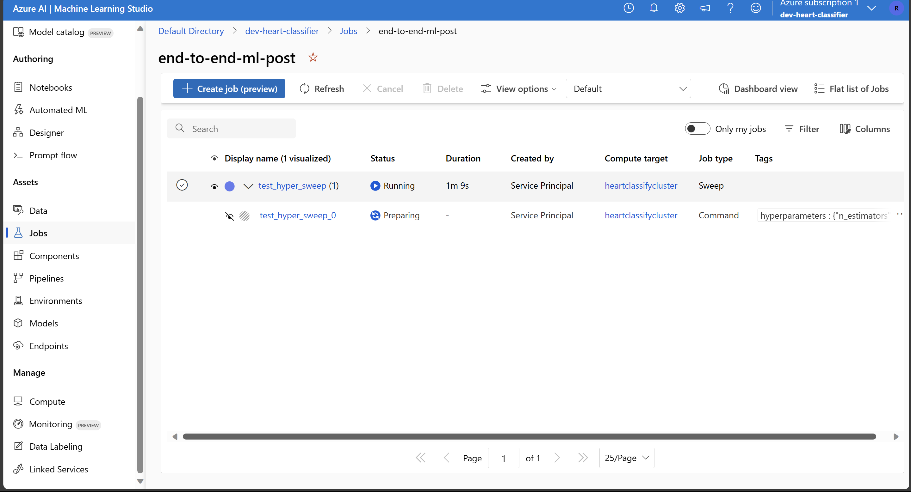
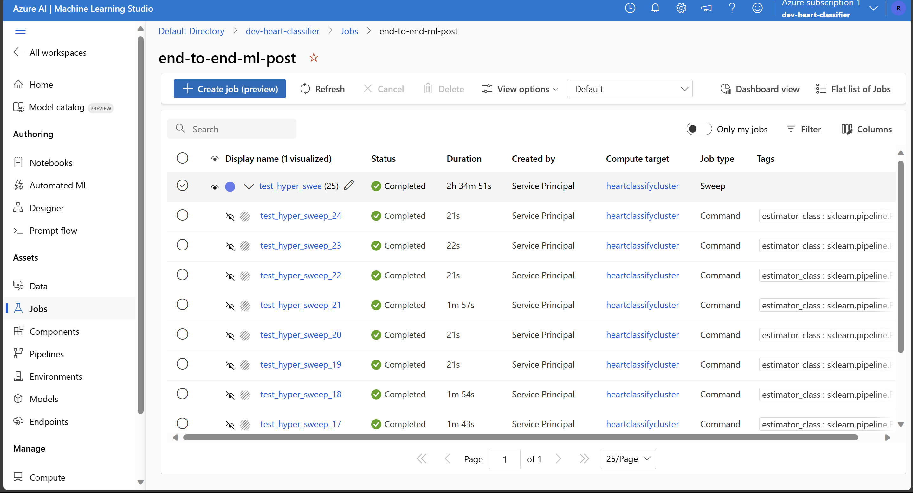

# Desbravando Machine Learning na Azure com um exemplo completo: Parte 2 - Treino, teste e inferência

## Introdução

Dando sequência ao nosso primeiro post sobre Machine Learning na Azure, estamos de volta para a tão aguardada segunda parte. Na [primeira parte](https://www.azurebrasil.cloud/desbravando-machine-learning-na-azure-parte-1-preparacao-do-ambiente/) focamos em preparar o terreno, criando os recursos necessários na Azure. Agora, direcionamos nosso foco para a implementação do pré processamento, treinamento de modelos com busca de hiperparâmetros e, para completar, a criação e teste de um endpoint de inferência.

Lembrando que todo o código fica disponibilizado no repositório ([end-to-end-ml-post](https://github.com/raca159/end-to-end-ml-post)).

## Desvendando o Workflow: Os passos que serão feitos

Com a conclusão da primeira etapa e a configuração do ambiente realizada, nosso foco agora se volta para a segunda etapa, onde implementamos um modelo em produção.

Nosso objetivo principal é evidenciar a facilidade de construir pipelines na Azure, focando na operacionalização do processo. Para isso, concentramos nossos esforços em um modelo de classificação, buscando otimizar seus parâmetros, um processo de pré-processamento, e fixamos uma métrica para guiar nossos resultados.

Podemos adentrar em diferentes estudos, explorando diversas arquiteturas de modelos e métodos de feature engineering nos posts seguintes.

### Segunda Etapa
#### 1 Análise e Pré-processamento do Dataset:
- Realizaremos uma análise detalhada das características do dataset, identificando padrões e estabelecendo um pipeline adequado para o pré-processamento de dados. Essa etapa é crucial para assegurar que os dados estejam prontos para serem consumidos pelo modelo.
#### 2 Criar um Job para Busca de hiperparâmetros:
- Lançaremos um job no cluster configurado para realizar a busca de hiperparâmetros. Esses ajustes são fundamentais e impactam diretamente o desempenho do modelo. O Azure Machine Learning simplifica esse processo, permitindo automação e execução eficiente de experimentos em paralelo.
#### 3 Seleção do Melhor Modelo:
- Com base nos resultados dos experimentos, escolheremos o melhor modelo, utilizando a acurácia como critério nesta instância. Essa escolha informada é essencial para garantir que o modelo final seja o mais eficaz possível.
#### 4 Criar um Endpoint de Inferência:
- Finalmente, implementaremos um endpoint de inferência no Azure Machine Learning. Isso nos permitirá realizar inferências em tempo real com o modelo encontrado.
#### 5 Testar o Modelo através do Endpoint:
- Concluiremos nosso workflow testando o modelo por meio do endpoint criado. Este é o último passo para garantir que nosso modelo esteja pronto para fornecer previsões precisas no ambiente de produção.

# Primeira Seção do Desenvolvimento: Rodando a Busca de hiperparâmetros em um Modelo de Machine Learning

Aqui, assumimos que o ambiente já está configurado, onde temos os dados já disponíveis no storage account e temos um Machine Learning Workspace com um ambiente customizado e um cluster pronto para ser utilizado.

## Definindo o modelo e o processamento de dados

Nesta seção, abordaremos o processo de busca de hiperparâmetros utilizando o cluster no Azure Machine Learning. Optamos por selecionar o modelo Random Forest devido à sua abordagem clássica, mas vale destacar que poderíamos escolher desde modelos simples, como regressão logística, até modelos mais complexos, como redes neurais.

A escolha do modelo dependerá do tamanho do dataset e da quantidade de features disponíveis, além dos requisitos do projeto. Deve-se lembrar que um dos pontos mais importantes na implementação de soluções com Machine Learning é a transparência e interpretabilidade. Podemos mitigar erros através de mecanismos de validação robustos, como, por exemplo, o uso de treinamento e teste via K-Folds, mas a capacidade de interpretar as escolhas do modelo é de suma importância.

Com a escolha do modelo feita, passamos a desenvolver o script de treinamento do modelo. Para isso, é necessário pensar no pré processamento dos dados, uma vez que eles são numéricos, booleanos e categóricos.
Uma solução eficaz é utilizar o Pipeline da biblioteca scikit-learn, onde podemos unir o modelo ao pré-processamento dos dados. Isso simplifica o script de inferência, uma vez que o processamento fica contido no modelo salvo.

O conjunto de dados [Heart Attack Analysis & Prediction Dataset](https://www.kaggle.com/datasets/rashikrahmanpritom/heart-attack-analysis-prediction-dataset/) apresenta uma tarefa de classificação binária com as seguintes características:
- `age`: Idade da pessoa
- `sex`: Gênero da pessoa
- `cp`: Tipo de dor no peito
- `trtbps`: Pressão arterial em repouso (mm Hg)
- `chol`: Colesterol em mg/dl obtido através do sensor de IMC
- `fbs`: Glicemia em jejum > 120 mg/dl (1 = verdadeiro; 0 = falso)
- `restecg`: Resultados eletrocardiográficos em repouso
- `thalachh`: Frequência cardíaca máxima alcançada
- `exng`: Angina induzida por exercício (1 = sim; 0 = não)
- `oldpeak`: Pico anterior

Lembrando que essas features incluem valores numéricos como idade, valores binários como sexo e valores categóricos como cp, que contém 4 categorias:
- Valor 1: Angina típica
- Valor 2: Angina atípica
- Valor 3: Dor não anginosa
- Valor 4: Assintomático

Escolhemos duas transformações para o pré-processamento dos dados. Para os dados numéricos, normalizaremos os valores para que possam ser interpretados em relação à média e ao desvio padrão.
Para os dados categóricos, utilizaremos a técnica de `one-hot encoding`. Para aplicar diferentes transformações em diferentes features, utilizaremos a classe `ColumnTransformer` do scikit-learn, onde podemos selecionar quais features queremos aplicar uma transformação. Juntando todas as peças, temos o seguinte código:
```python
from sklearn.ensemble import RandomForestClassifier
from sklearn.preprocessing import StandardScaler, OneHotEncoder
from sklearn.pipeline import Pipeline
from sklearn.compose import ColumnTransformer

# Cria uma transformação de coluna onde aplicamos normalização para features numéricas e one-hot encoding para features categóricas. Features booleanas não precisam de pré-processamento.
data_transformation_step = ColumnTransformer([
    ('std_scaler', StandardScaler(), ['age', 'trtbps', 'chol', 'thalachh', 'oldpeak']),
    ('one_hot_encoding', OneHotEncoder(), ['cp', 'restecg'])
])

# Aqui combinamos o modelo Random Forest com a transformação em um pipeline.
# Mais tarde, os parâmetros do Random Forest serão escolhidos através da busca de hiperparâmetros.
model = Pipeline([
    ('transform_columns', data_transformation_step),
    ('random_forest', RandomForestClassifier(
        n_estimators=100,
        max_depth=None,
        criterion='gini',
        max_features='sqrt'
    ))
])
```

Com a escolha do modelo e do processamento de dados, podemos montar o script de treinamento. O script executa as seguintes etapas:
- Registra os parâmetros escolhidos através do `mlflow`.
- Carrega os dados.
- Divide os dados entre treinamento e teste para validar a performance do modelo.
- Treina o modelo nos dados de treino.
- Testa o modelo nos dados de teste.
- Salva o modelo.

Abaixo está o script de treinamento completo:
```python
import argparse
import os
import mlflow
import mlflow.sklearn
import pandas as pd
import numpy as np
from sklearn.model_selection import train_test_split
from sklearn.ensemble import RandomForestClassifier
from sklearn.preprocessing import StandardScaler, OneHotEncoder
from sklearn.pipeline import Pipeline
from sklearn.compose import ColumnTransformer

# Função para carregar e dividir os dados
def get_data(args):
    df = pd.read_csv(args.input_data)
    if 'Unnamed: 0' in df.columns:
        del df['Unnamed: 0']
    Xdf = df.drop(columns=['output'])
    y = df['output'].values
    X_train, X_test, y_train, y_test = train_test_split(
        Xdf, y, random_state=0, test_size=float(args.test_size)
    )
    return X_train, X_test, y_train, y_test

# Função para treinar o modelo
def train_model(args, X_train, y_train):
    data_transformation_step = ColumnTransformer([
        ('std_scaler', StandardScaler(), ['age', 'trtbps', 'chol', 'thalachh', 'oldpeak']),
        ('one_hot_encoding', OneHotEncoder(), ['cp', 'restecg'])
    ])

    max_depth = args.max_depth
    if max_depth == -1:
        max_depth = None

    max_features = args.max_features
    if max_features == 'None':
        max_features = None

    model = Pipeline([
        ('transform_columns', data_transformation_step),
        ('random_forest', RandomForestClassifier(
            n_estimators=args.n_estimators,
            max_depth=max_depth,
            criterion=args.criterion,
            max_features=max_features
        ))
    ])
    model = model.fit(X_train, y_train)
    return model

# Função para testar o modelo
def test_model(model, X_test, y_test):
    score = model.score(X_test, y_test)
    return score

# Função para salvar o modelo
def save_model(args, model):
    model_name = args.model_name

    # Registrando o modelo no workspace
    mlflow.sklearn.log_model(
        sk_model=model,
        registered_model_name=model_name,
        artifact_path=model_name
    )
    # Salvando o modelo em um arquivo
    mlflow.sklearn.save_model(
        sk_model=model,
        path=os.path.join(model_name, "trained_model"),
    )

# Função principal de execução
def execution(args):
    # Inicia o logging
    mlflow.start_run()
    # Ativa o autologging
    mlflow.sklearn.autolog()
    # Registra métricas
    mlflow.log_param('criterion', str(args.criterion))
    mlflow.log_param('max_features', str(args.max_features))
    mlflow.log_metric('n_estimators', float(args.n_estimators))
    mlflow.log_metric('max_depth', float(args.max_depth))

    # Obtém os dados
    X_train, X_test, y_train, y_test = get_data(args)
    # Treina o modelo
    model = train_model(args, X_train, y_train)
    # Testa o modelo
    score = test_model(model, X_test, y_test)
    # Salva o modelo
    save_model(args, model)
    # Registra resultados
    mlflow.log_metric('Score', float(score))
    # Finaliza o logging do mlflow
    mlflow.end_run()

# Função principal
def main():
    parser = argparse.ArgumentParser()
    parser.add_argument('--input_data', type=str, help='Caminho para os dados')
    parser.add_argument('--model_name', type=str, default="test_model", help='Nome do modelo a ser registrado posteriormente')
    parser.add_argument('--test_size', type=float, default=0.3, help='Tamanho do conjunto de teste para treinamento e validação')
    parser.add_argument('--n_estimators', type=int, default=100, help='Parâmetro n_estimators do modelo RandomForestClassifier')
    parser.add_argument('--max_depth', type=int, default=-1, help='Parâmetro max_depth do modelo RandomForestClassifier')
    parser.add_argument('--criterion', type=str, default='gini', help='Parâmetro criterion do modelo RandomForestClassifier')
    parser.add_argument('--max_features', type=str, default='sqrt', help='Parâmetro max_features do modelo RandomForestClassifier')
    execution(parser.parse_args())

if __name__ == '__main__':
    main()
```

## Implementando a Busca de hiperparâmetros no Azure Machine Learning

Agora que temos o ambiente pronto, o modelo, o pipeline de processamento de dados definido e o script de treinamento preparado, podemos avançar para a busca de hiperparâmetros. A Azure oferece suporte a esse processo, permitindo que lancemos um job para o cluster com o objetivo de executar a busca de hiperparâmetros e visualizar os resultados no portal enquanto está em execução.

Antes de iniciar a busca de hiperparâmetros, precisamos selecionar os parâmetros que desejamos otimizar e definir as opções para cada um. Aqui buscaremos apenas os parâmetros do modelo, mas poderíamos incluir opções de processamento de dados diferentes, seleção de features, e etc. Em Python, isso é feito da seguinte forma:
```python
import azure.ai.ml.sweep as sweep_types

# Dicionário contendo os parâmetros para a busca e as opções para eles.
sweep_inputs = {
    'n_estimators': sweep_types.Choice([5, 10, 50, 100, 125]),
    'max_depth': sweep_types.Choice([4, 6, -1]),
    'criterion': sweep_types.Choice(["gini", "entropy"]),
    'max_features': sweep_types.Choice(["sqrt", "log2"])
}
```

Além dos parâmetros que estamos buscando, também precisamos definir os parâmetros fixos, como o nome do modelo, o tamanho percentual do conjunto de teste e os valores iniciais para os parâmetros que queremos otimizar. Podemos fazer isso da seguinte maneira:
```python
model_name = 'rf_model_test'
inputs = {
    'model_name': model_name,
    'test_size': 0.3,
    'n_estimators': 100,
    'max_depth': -1,
    'criterion': 'gini',
    'max_features': 'sqrt',
}

```

Para passar os dados contidos no container no storage account para o script de treinamento, precisamos criar uma função que retorna o URI do arquivo `heart.csv`. Isso é feito usando um wrapper da Azure. Aqui está a função:
```python
input_data = env_builder.get_datafile_in_blob_for_job_sweep(
    containername=container_name, accountname=storage_account_name,
    filename=filepath, folder=None
)
```

Para lançar o script, precisamos definir o comando que a Azure utilizará para executar o script de treinamento. O comando será algo como:
```bash
python model_train.py --input_data ${{inputs.input_data}} --model_name ${{inputs.model_name}} --test_size ${{inputs.test_size}} --n_estimators ${{inputs.n_estimators}} --max_depth ${{inputs.max_depth}} --criterion ${{inputs.criterion}} --max_features ${{inputs.max_features}}
```

Isso garante que o script de treinamento receba todos os parâmetros necessários para executar a busca de hiperparâmetros.
Com todos esses elementos prontos, podemos lançar a busca de hiperparâmetros na Azure Machine Learning, acompanhando os resultados no portal enquanto o processo está em execução.

## Lançando a Busca de hiperparâmetros no Azure Machine Learning

Agora que temos o comando para o treinamento definido, o input para o modelo, e o espaço de busca definido, podemos usar o `ml_client` para lançar a busca de hiperparâmetros no cluster. Para isso, criaremos uma função de suporte que cria um `Job` com as configurações de `Workspace`, `Environment`, `Compute`, e script de treinamento e aplica a busca de hiperparâmetros usando o comando sweep. Essa função permite que você ajuste a quantidade máxima de execuções que a busca deve fazer.

```python
import azure.ai.ml.sweep as sweep_types

# Comando bash que lança o treinamento
command_str = 'python model_train.py --input_data ${{inputs.input_data}} --model_name ${{inputs.model_name}} --test_size ${{inputs.test_size}} --n_estimators ${{inputs.n_estimators}} --max_depth ${{inputs.max_depth}} --criterion ${{inputs.criterion}} --max_features ${{inputs.max_features}}'

# Nome do modelo usado para salvar o arquivo pickle
model_name = 'rf_model_test'

# Informações de input que serão fixadas em todas as execuções + parâmetros padrão para a busca de hiperparâmetros
inputs = {
    'input_data': input_data,
    'model_name': model_name,
    'test_size': 0.3,
    'n_estimators': 100,
    'max_depth': -1,
    'criterion': 'gini',
    'max_features': 'sqrt',
}

# Parâmetros que terão seus valores alterados durante a busca
sweep_inputs = {
    'n_estimators': sweep_types.Choice([10, 50, 100, 125, 150]),
    'max_depth': sweep_types.Choice([4, 6, 8, 10, -1]),
    'criterion': sweep_types.Choice(["gini", "entropy"]),
    'max_features': sweep_types.Choice(["sqrt", "log2"])
}

# Nome do cluster de computação
compute = "heartclassifycluster"
# Nome do ambiente
environment='sklearn-env:1'
# Nome do experimento
experiment_name='test_hiper_sweep'
# Lança a busca de hiperparâmetros
_ = env_builder.launch_hiperparam_search(
    command_str=command_str, inputs=inputs,
    sweep_inputs=sweep_inputs, experiment_name=experiment_name,
    ml_client=ml_client, compute=compute, environment=environment,
    max_total_trials=25, max_concurrent_trials=1,   
)
```

Com a execução do código, criamos um experimento que será lançado no cluster de computação. É possível configurar parâmetros adicionais para a busca de hiperparâmetros, por hora, como já foram limitados para 25 execuções, isso não é necessário. Nas imagens temos o experimento que foi lançado no cluster e a primeira execução sendo preparada para rodar.



Após finalizar a busca de hiperparâmetros. Temos o experimento com o status completo e a lista de todas as execuções feitas durante a busca de parâmetros.


Como foram registrados os parâmetros para cada execução usando o `mlflow`. Podemos ir na aba `Trials` do experimento e criar e visualizar diferentes gráficos para identificar o impacto de diferentes parâmetros sobre a performance.


Note que as métricas e parâmetros a serem registrados são totalmente customizáveis através do `mlflow`. Nesse caso, regsitramos apenas as métricas pertinentes ao processo, mas o sistema é flexível para suportar casos mais complexos onde é interessante, por exemplo, treinar modelos de Deep Learning e registrar o processo ao longo do treinamento do modelo.

# Selecionando o Melhor Modelo e Criando o Ponto de Inferência

Depois que a busca de parâmetros termina, podemos selecionar o melhor modelo, este processo é facilmente feito através da propriedade `best_child_run_id` da execução raiz lançada.
Para criar o endpoint, precisamos registrar o melhor modelo no repositório de modelos. Desta forma, podemos atualizar o melhor modelo à medida que aprimoramos o modelo com treinamento, novas features, mais dados, etc. Isso nos permite versionar e ter controle das diferentes versões de melhores modelos e atualizar os endpoints a partir dessa informação.

Inicialmente, acessamos o Job que rodou a busca de parâmetros. Podemos fazer isso navegando até o portal Azure, indo para o workspace do Azure Machine Learning, navegando até a aba "Jobs", acessando e obtendo o nome da execução. Alternativamente, podemos listar os jobs com o `ml_client` e filtrar os jobs cujo "display_name" bate com o nome do experimento que foi configurado no código. Em código, temos:
```python
# Nome recuperado do portal Azure
sweep_job = ml_client.jobs.get('epic_queen_hxxnbd82jc')
# Ou você pode acessar os jobs do ml_client e obter aquele que corresponde ao nome do experimento configurado anteriormente.
jobs = ml_client.jobs.list()
jobs = list(filter(lambda x: x.display_name == experiment_name, jobs))
sweep_job = jobs[0]
```
Com o Job em mãos, podemos registrar o melhor modelo com o código:
```python
best_model = env_builder.register_best_model_from_sweep(
    ml_client=ml_client, returned_sweep_job=sweep_job,
    model_name=model_name, register_name=f'best_{model_name}'
)
```

No script de treinamento salvamos os modelos como artefatos, como vemos na imagem abaixo, temos acessos a todos os modelos salvos e no topo, temos o modelo que foi considerado como o melhor modelo que será utilizado no endpoint de inferencia.


Com o melhor modelo registrado, podemos focar no script de inferência para criar o endpoint. Usaremos o script template disponibilizado pela Azure, que essencialmente exige a definição das funções `init()` e `run()`. A primeira é para inicialização do modelo, enquanto a segunda é para quando o modelo recebe uma solicitação de inferência.

Neste caso, o `init()` carregará apenas o modelo scikit-learn, enquanto a função `run()` transformará os dados da solicitação em um DataFrame usando `pd.DataFrame.from_records(...)`. Isso significa que cada solicitação recebida deve ter as informações-chave da coluna, pois elas são usadas para transformar os dados, normalizando-os e aplicando a codificação one-hot. Segue abaixo o script `score.py` que será utilizado:
```python
import os
import logging
import json
import joblib
import pandas as pd


def init():
    """
    This function is called when the container is initialized/started, typically after create/update of the deployment.
    You can write the logic here to perform init operations like caching the model in memory
    """
    global model
    # AZUREML_MODEL_DIR is an environment variable created during deployment.
    model_path = os.path.join(
        os.getenv("AZUREML_MODEL_DIR"), 'rf_model_test', "model.pkl"
    )
    # deserialize the model file back into a sklearn model
    model = joblib.load(model_path)
    logging.info("Init complete")


def run(raw_data):
    """
    This function is called for every invocation of the endpoint to perform the actual scoring/prediction.
    In the example we extract the data from the json input and call the scikit-learn model's predict()
    method and return the result back
    """
    logging.info("Request received")
    data = json.loads(raw_data)["data"]
    df_data = pd.DataFrame.from_records(data)
    result = model.predict(df_data)
    logging.info("Request processed")
    return result.tolist()
```
Com o script de inferência pronto, podemos criar o endpoint. Utilizaremos uma instância de computação pequena devido ao tamanho do modelo. O código para isso é:
```python
# Nome a ser usado
endpoint_name = 'heart-classify-endpoint'
deployment_name = 'heart-classify-deployment'
get_model_name = f'best_{model_name}'

# Você pode acessar o melhor modelo usando o ml client
melhor_modelo = ml_client.models.get(get_model_name, version=1)

# Você também pode acessar o ambiente usando o ml client
model_environment = ml_client.environments.get(
    name=environment.split(':')[0],
    version=environment.split(':')[1]
)

# Criar endpoint
_ = env_builder.create_endpoint_specs(ml_client=ml_client, endpoint_name=endpoint_name)
_ = env_builder.get_or_create_endpoint_deployment(
        ml_client=ml_client, deployment_name=deployment_name,
        model=melhor_modelo, env=model_environment,
        endpoint_name=endpoint_name, code="./src", filepath="score.py",
        instance_type='Standard_DS1_v2'
    )
```

Este código cria um endpoint e um deployment associado a esse endpoint. Lembre-se de configurar adequadamente o ambiente e os parâmetros conforme necessário para o seu caso de uso específico. Podemos ver o endpoint atráves do portal:


# Testando o Endpoint de Inferência

Com o endpoint criado, agora podemos nos concentrar em testá-lo usando a biblioteca `requests`. Para isso, devemos acessar a chave de autenticação disponível no portal da Azure. Vá para o recurso Azure Machine Learning, selecione a aba "Endpoints", escolha o endpoint atual e copie a chave. A chave será armazenada como uma variável de ambiente. Para obter o URL do endpoint, podemos acessar o portal ou usar o `ml_client`.

Afim de testar o modelo no endpoint, vamos carregar os dados `heart.test.csv` e enviá-los via requisição para o endpoint:
```python
import requests
import pandas as pd
import numpy as np
from dotenv import load_dotenv

# Adquirindo o token e o URL do endpoint
_ = load_dotenv()
endpoint = ml_client.online_endpoints.get(name=endpoint_name)
endpoint_token = os.environ.get('ENDPOINT_TOKEN')
url = endpoint.scoring_uri

headers = {
    'Content-Type':'application/json',
    'Authorization':('Bearer '+ endpoint_token),
    'azureml-model-deployment': deployment_name
}

# Carregamos os dados e os enviamos
df = pd.read_csv('heart.test.csv', index_col=0)
df_input = df.drop(columns=['output'])
samples_target = df['output'].values
samples_ready_to_send = {
    'data': df_input.to_dict(orient='records')
}

response = requests.post(url, data=str.encode(json.dumps(samples_ready_to_send)), headers=headers)
inference_result_request = np.array(response.json())
```
Com os resultados do endpoint de inferência como um array, usamos a biblioteca scikit-learn para gerar o relatório de classificação usando os resultados da inferência.
```python
from sklearn.metrics import classification_report
print(classification_report(samples_target, inference_result_request))
```
```
              precision    recall  f1-score   support

           0       0.62      0.77      0.69        13
           1       0.80      0.67      0.73        18

    accuracy                           0.71        31
   macro avg       0.71      0.72      0.71        31
weighted avg       0.73      0.71      0.71        31
```
Este código permite que você avalie o desempenho do modelo no conjunto de testes, usando o endpoint de inferência. Certifique-se de ter configurado corretamente as variáveis de ambiente e as dependências antes de executar o código.

## Deletando Recursos e Conclusão

Novamente, lembre-se de que os recursos na Azure são cobrados. Portanto, é uma prática recomendada excluir os recursos que não são mais necessários para evitar custos desnecessários.

```python
env_builder.ml_workspace_deletion(ml_client=ml_client, workspace=workspace)

delete_result = env_builder.get_and_delete_rg(
    resource_group_name=resource_group_name,
    subscription_id=SUBSCRIPTION_ID
)
```
Ao executar esse código, todos os recursos no grupo de recursos serão deletados.

Com isso, chegamos ao final do nosso primeiro post. Fizemos desde a criação do ambiente até a inferência de um modelo treinado com busca de hiperparâmetros por meio de um endpoint na Azure.

Com essas etapas concluídas, podemos alterar os dados, o pipeline de pré-processamento e/ou o modelo, seus parâmetros, e/ou as máquinas do cluster e do endpoint de inferência para acomodar diferentes projetos dentro do ecossistema de Machine Learning da Azure.

No próximo post, desenvolveremos uma ideia semelhante, mas sem utilizar o Azure Machine Learning Workspace. Em vez disso, trabalharemos com os dados e modelos dentro do ecossistema do Databricks, uma ferramenta que permite a criação de um pipeline similar. Desta forma, abordaremos as diferentes maneiras de desenvolver pipelines de Machine Learning na Azure.

Espero que este post tenha ajudado você, e nos vemos no próximo!